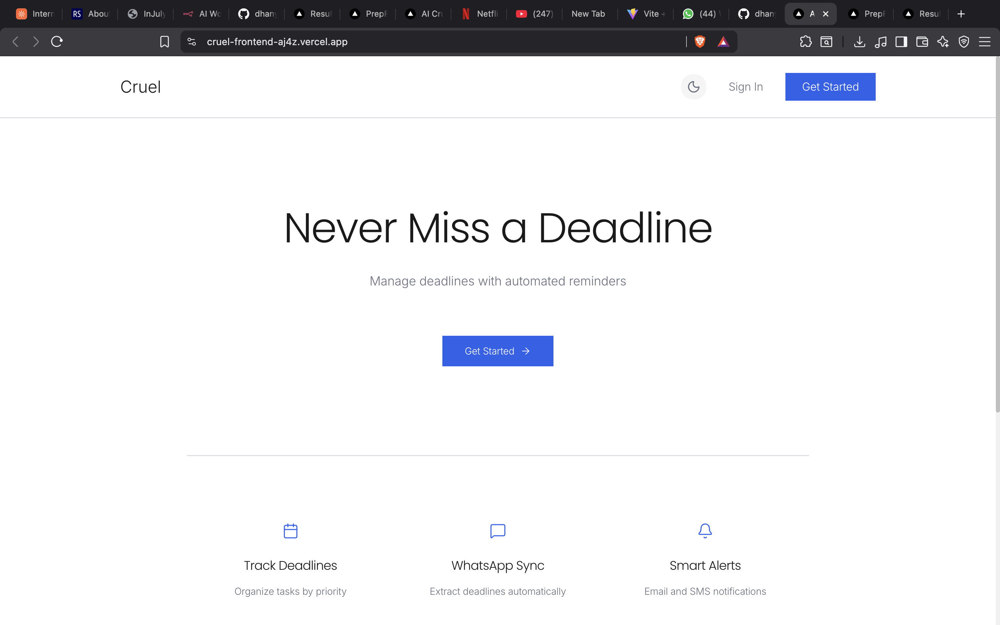
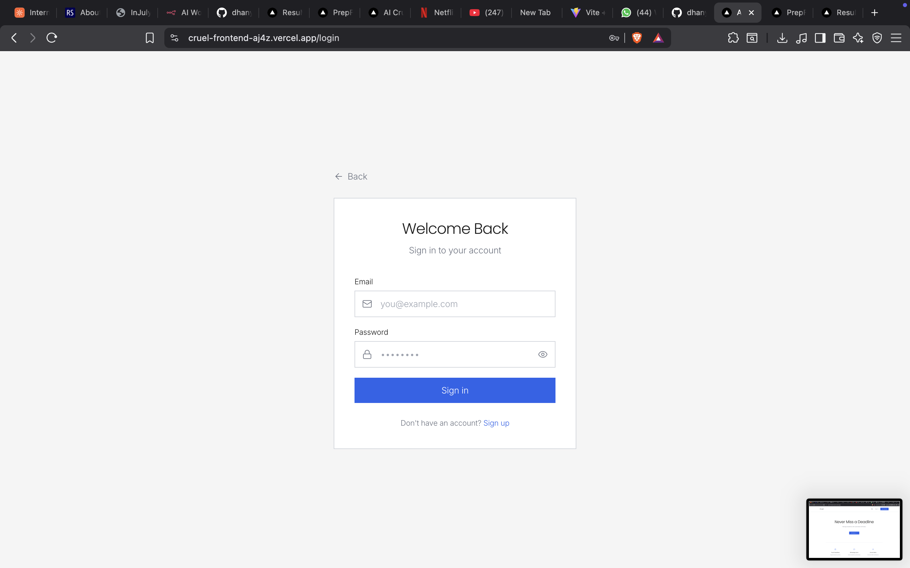
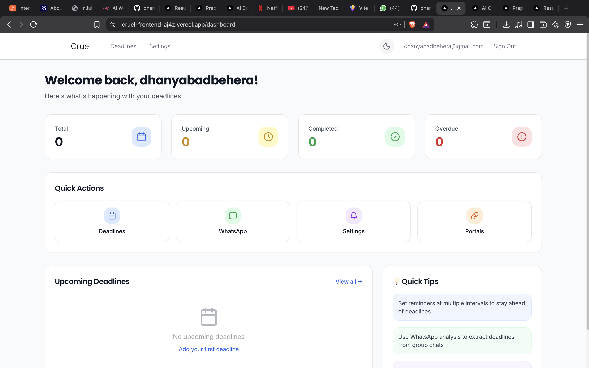
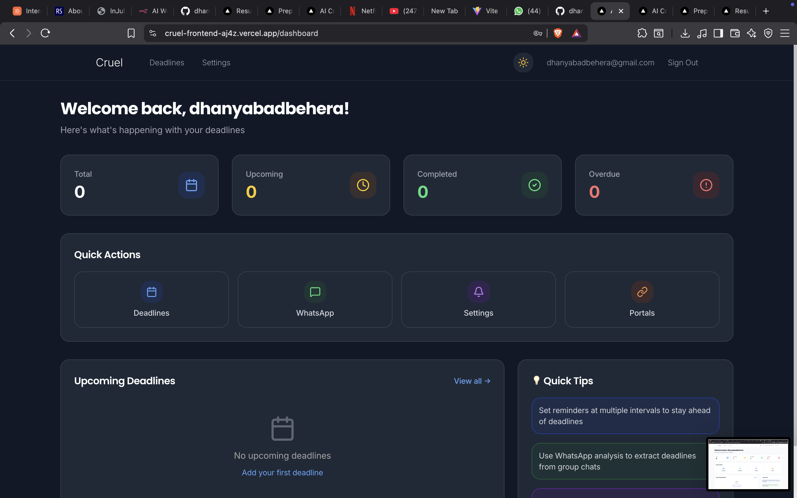

# Cruel Frontend

A modern Next.js frontend application with a comprehensive dashboard, deadline tracking, and notification management system.

## Getting Started

First, run the development server:

```bash
npm run dev
# or
yarn dev
# or
pnpm dev
# or
bun dev
```

Open [http://localhost:3000](http://localhost:3000) with your browser to see the result.

You can start editing the page by modifying `app/page.tsx`. The page auto-updates as you edit the file.

## Screenshots









## Features

-   User authentication and authorization
-   Dashboard with statistics and portal overview
-   Deadline tracking and management
-   Notification preferences and settings
-   WhatsApp integration
-   Dark/Light theme toggle
-   Responsive design

## Project Structure

-   `/src/app` - Next.js pages and API routes
-   `/src/components` - Reusable React components
-   `/src/contexts` - React context providers (Auth, Theme)
-   `/src/services` - API service layer
-   `/src/lib` - Utility functions and API helpers
-   `/src/types` - TypeScript type definitions
-   `/public` - Static assets

## Learn More

To learn more about Next.js, take a look at the following resources:

-   [Next.js Documentation](https://nextjs.org/docs) - learn about Next.js features and API.
-   [Learn Next.js](https://nextjs.org/learn) - an interactive Next.js tutorial.

You can check out [the Next.js GitHub repository](https://github.com/vercel/next.js) - your feedback and contributions are welcome!

## Deploy on Vercel

The easiest way to deploy your Next.js app is to use the [Vercel Platform](https://vercel.com/new?utm_medium=default-template&filter=next.js&utm_source=create-next-app&utm_campaign=create-next-app-readme) from the creators of Next.js.

Check out our [Next.js deployment documentation](https://nextjs.org/docs/app/building-your-application/deploying) for more details.
